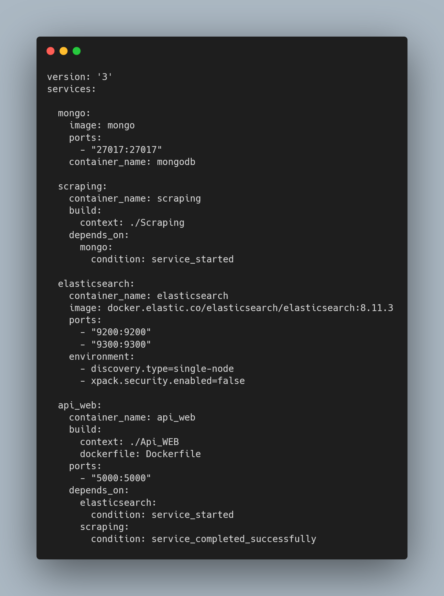

## <span style="color:red">⚠ THIS README IS IN FRENCH, PLEASE USE TRANSLATER IF NEEDED ⚠</span>
<br><br>

<br><br>


#### OUTILS : (Scrapy / MongoDB / Flask / ElasticSearch) via Python; HTML/CSS/JS; Docker

Projet qui récupère les données hébergées sur le site *'senscritique.com'*, les stocke sur une 
base de données Mongo et les affiche à travers une application Web grâce à l'utilisation de 
Flask.<br>
Pour améliorer le service Web, nous avons également utilisé ElasticSearch, du CSS et du 
JavaScript. Il utilise la technologie Docker pour faciliter sa portabilité et sa reproductibilité.

###### Résultat du projet


## Guide de l’utilisateur
- [Avant tout](#avant-tout) 
- [Installation](#1---installation) 
- [Lancer le projet](#2---lancer-le-projet)
- [Utiliser l'application Flask](#3---utiliser-lapplication-flask)

## Guide du développeur
- [Logique du projet](#1---logique-du-projet)
    - [Structure du projet](#structure-du-dossier)
    - [D'un point de vue global](#dun-point-de-vue-global)
    - [D'un point de vue plus approfondi](#dun-point-de-vue-plus-approfondi)
        - [Gestion des packages Python](#gestion-des-packages-python)
        - [Conception de deux images Docker](#conception-de-deux-images-docker)
        - [Codes Python](#codes-python)
- [Pourquoi Flask et Mongo ?](#2---pourquoi-flask-et-mongo-)
- [Continuer le projet](#3---continuer-le-projet)


# GUIDE DE L’UTILISATEUR

### Avant tout

Dans un premier temps, regardons, ce que vous devez installer pour pouvoir récupérer et utiliser 
le projet.

Deux outils sont nécessaires :
1) Il faut avoir <a href="https://git-scm.com/download" target="_blank">Git</a> pour cloner le 
   projet depuis le dépôt en ligne GitHub.
2) Il faut avoir <a href="https://www.docker.com/products/docker-desktop/" target="_blank">DockerDesktop</a>
pour faire fonctionner le projet.

## 1 - Installation

Dans cette partie, nous allons importer le projet disponible sur GitHub dans le but de l’avoir 
sur la machine locale.

Pour ce faire, ouvrez le ‘Git Bash’, vous pouvez le chercher depuis la barre
de recherche de votre système d'exploitation, et rendez-vous dans le dossier où vous désirez stocker
le projet grâce à la commande :
```bash 
$ cd <sous-répertoire désiré>/
```
<br>
Lorsque vous êtes à l'endroit désiré, rentrez la commande suivante dans le 
terminal :

```bash 
$ git clone https://github.com/hugocrt/data_engineering_e4_project
```
<br>
⚠ Attendez l'importation totale du projet ⚠

## 2 - Lancer le projet

Commencez par rejoindre le dossier du projet :
```bash 
$ cd data_engineering_e4_project/
```
Une fois dedans, affichez le contenu grâce à la commande :
```bash 
$ ls
```
Vous devriez normalement voir cela :
<br><br>

<br><br>
Une fois que vous êtes bien dans ce répertoire, vérifiez que votre application DockerDesktop 
est en fonctionnement (application sur la droite de l'image).
<br><br>

<br><br>
Enfin, pour lancer le projet, il suffit de rentrer la commande suivante dans le GitBash.
```bash 
$ docker-compose up -d
```

Une fois cela fait, vous devriez voir apparaître des lignes dans votre Bash. Ces dernières ne 
seront pas forcément identiques à celles de l'image ci-dessous si c'est votre première 
installation du projet, cela ne change rien. 
<br><br>
<br>
<br><br>
Veuillez attendre jusqu'à ce que vous voyiez un groupe de conteneurs apparaître dans votre 
application DockerDesktop, cela peut prendre plusieurs minutes selon votre connexion internet.<br>
Il y a 4 services (4 conteneurs distincts ici) dans ce groupe de conteneurs, le service 
'api_web' ne passera au vert que lorsque 'scraping' sera terminé.

###### DockerDesktop lorsque le groupe de conteneurs vient d'être créé
<br>
###### DockerDesktop une fois 'scraping' terminé correctement
<br>

Veillez à ne pas arrêter les services pour le bon fonctionnement de l'application Web Flask.<br>
Une fois le service 'api_web' en vert, vous pouvez cliquer sur le port souligné en bleu 
*'5000 :5000'* (voir image ci-dessus) ou bien cliquer sur ce
<a href="http://localhost:5000" target="_blank">lien</a>.

## 3 - Utiliser l'application Flask

Lorsque vous ouvrez le lien, vous arrivez sur la page d'accueil, c'est une utilisation 
classique de site Web :
- Une barre de navigation est disponible en haut de la page. 
- En bas de page se trouve un footer avec des informations.
- Concernant le contenu de chaque page, vous trouverez plus de détails sur comment utiliser et 
  comprendre nos pages ci-dessous.

###### Page d'accueil du service Web
<br>

Vous y trouverez quelques informations concernant le projet et le site. 

###### Page de visualisation de la base de données
<br>

Ici, vous trouverez tous les films que nous récupérons et toutes les informations relatives à 
ces derniers. Vous pouvez ajuster la recherche grâce à des filtres et les trier par ordre 
croissant et décroissant (rang).

###### Page de visualisation de la base de données (pagination)
<br>

Comme vous pouvez le voir, afin de rendre tout cela visible, nous avons bloqué à 30 le nombre de 
films par page, cela implique donc un système de pages ! Vous pouvez naviguer librement 
entre les différentes pages grâce aux boutons (+/- 1 page) ou grâce à un sélecteur pour choisir 
n'importe quelle page disponible.

###### Page de visualisation géographique (carte)
<br>

Ici, vous pouvez retrouver le nombre de films par pays dans le top 1000 de manière visuelle, avec 
une légende colorée et une courte analyse en dessous de la carte. Vous pouvez bien entendu vous 
déplacer et utiliser les outils de zoom sur la carte.

###### Page d'analyses
<br>

Sur cette page, vous retrouverez différentes analyses appuyées par des graphiques.
<br><br>
### <span style="color : dodgerblue">Bonne exploration sur notre application Web٩(^ᴗ^)۶</span>

# GUIDE DU DÉVELOPPEUR

Dans un premier temps, nous rappelons que nous avons codé en anglais pour que cela soit 
compréhensible de tous.

## 1 - Logique du projet

###### Structure du dossier

```cmd
C:.(data_engineering_e4_project)
|   docker-compose.yml
|   README.md
|
+---Api_WEB
|   |   Dockerfile
|   |   Pipfile
|   |   Pipfile.lock
|   |   requirements.txt
|   |   root.py
|   |
|   \---Web
|       +---Elasticsearch_utils
|       |   |   elasticsearch_operations.py
|       |   |   elasticsearch_setup.py
|       |   |   __init__.py
|       |   |
|       |   \---__pycache__
|       |           elasticsearch_operations.cpython-311.pyc
|       |           elasticsearch_setup.cpython-311.pyc
|       |           __init__.cpython-311.pyc
|       |
|       +---FlaskApp
|       |   |   routes.py
|       |   |   __init__.py
|       |   |
|       |   +---annexes
|       |   |       geocoded_countries.csv
|       |   |
|       |   +---static
|       |   |   +---css
|       |   |   |       base.css
|       |   |   |       db.css
|       |   |   |       map.css
|       |   |   |
|       |   |   +---img
|       |   |   |       clear_icon.png
|       |   |   |       duration_hist.png
|       |   |   |       ESIEE_Paris_BLANC.png
|       |   |   |       genres_piechart.png
|       |   |   |       next-icon.png
|       |   |   |       previous-icon.png
|       |   |   |       search.png
|       |   |   |       year_hist.png
|       |   |   |
|       |   |   \---js
|       |   |           db_script.js
|       |   |
|       |   +---templates
|       |   |       analysis.html
|       |   |       base.html
|       |   |       db.html
|       |   |       index.html
|       |   |       map.html
|       |   |
|       |   \---__pycache__
|       |           app_functions.cpython-311.pyc
|       |           routes.cpython-311.pyc
|       |           __init__.cpython-311.pyc
|       |
|       \---utils
|           |   utils.py
|           |   __init__.py
|           |
|           \---__pycache__
|                   utils.cpython-311.pyc
|                   __init__.cpython-311.pyc
|
+---img
|       analyse1.png
|       carte.png
|       cloning-project.png
|       code-db-page.png
|       code-docker-compose.png
|       code-filter-class.png
|       code-search-movies.png
|       compose.png
|       dash-project.png
|       db1.png
|       db2.png
|       demo.gif
|       desktop1.png
|       desktop2.png
|       docker-compose-up-d.png
|       ls-project.png
|       readme-banner.png
|       taskbar.png
|       web_accueil.png
|
\---Scraping
    |   Dockerfile
    |   Pipfile
    |   Pipfile.lock
    |   requirements.txt
    |   scrapy.cfg
    |
    \---Scraping
        |   items.py
        |   middlewares.py
        |   pipelines.py
        |   settings.py
        |   __init__.py
        |
        +---spiders
        |   |   movie_retriever.py
        |   |   __init__.py
        |   |
        |   \---__pycache__
        |           movie_retriever.cpython-311.pyc
        |           __init__.cpython-311.pyc
        |
        \---__pycache__
                items.cpython-311.pyc
                pipelines.cpython-311.pyc
                settings.cpython-311.pyc
                __init__.cpython-311.pyc
```

### D'un point de vue global

Il est toujours primordial de bien séparer les différentes tâches d'une application dans un projet 
afin de la rendre modulable, lisible et facile à utiliser. Cela est d'autant plus vrai lorsque le 
projet utilise Docker (<a href="https://www.youtube.com/watch?v=caXHwYC3tq8&t=68s" target="_blank">comprendre Docker</a>). 
En effet, séparer les différentes tâches permet de les conteneuriser.<br> 
Docker-compose nous permet d'automatiser le lancement de nos conteneurs et de gérer les 
dépendances.
<br><br>
Dans notre docker-compose, on retrouve bien les deux grandes parties de notre projet :
- Récupérer/Stocker les données grâce au scraping
- Utiliser/Afficher les données grâce au web

ElasticSearch et Mongo sont deux services nécessaires aux deux cités précédemment.<br>

###### docker-compose.yml
<br>

### D'un point de vue plus approfondi

#### Gestion des packages Python
Concernant la gestion des packages nécessaires au projet, nous avons procédé en deux temps :
1) Création des *requirements.txt* pour cibler les packages nécessaires aux dossiers courants.
2) Création des *Pipfile/Pipfile.lock* à partir des requirements.txt qui sont une approche plus 
   moderne et professionnelle que ces derniers.

#### Conception de deux images Docker

Nous avons créé deux images Docker grâce à deux Dockerfile pour avoir nos conteneurs 
personnalisés :
- scraping
- api_web

#### Codes Python

On ne s'attardera pas sur les détails de nos codes, en effet, dans les fichiers, il y a 
des commentaires et des docstrings. De plus, voici deux brèves introductions :
- <a href="https://www.youtube.com/watch?v=m_3gjHGxIJc&t=1181s" target="_blank">Comprendre 
  Scrapy</a>
- <a href="https://www.youtube.com/watch?v=mqhxxeeTbu0" target="_blank">Comprendre Flask</a>

Cependant, une fois de plus, il est important de bien scinder le projet. Il y a donc une 
multitude de fichiers Python afin de rendre le code modulable, clair et concis.<br>

Nous avons également essayé de nous rapprocher d'une approche *Objet Orienté*, en voici un exemple :

<br>
<br>
<br>

Cela permet de rendre le code plus compréhensible et de réduire la duplication de code notamment 
dans notre méthode *search_movies* grâce à l'utilisation d'une boucle sur notre objet *filters*.

## 2 - Pourquoi Flask et Mongo ?

Il existe de nombreux services de base de données. Nous avons choisi Mongo pour sa flexibilité 
quant aux objets qu'on lui envoie et sa grande facilité d'utilisation. C'est une solution 
simple, rapide et efficace.<br>

Nous avions utilisé Dash dans un autre projet similaire (voir ci-dessous) et l'on voulait 
découvrir une nouvelle manière de faire, Flask semble être un choix judicieux pour commencer 
grâce à sa prise en main facile et ses nombreuses fonctionnalités. Cependant, la prochaine fois 
que nous ferons un projet de ce type, nous essayerons Django, qui a d'autres points forts comme 
en matière de sécurité.

###### Extrait du projet Dash
<br>


## 3 - Continuer le projet

Nous avons fait des choix délibérés par manque de temps et par envie de découvrir un maximum de 
choses. Par exemple, nous avons préféré approfondir ElasticSearch au détriment de notre carte (on 
peut sortir des limites de la carte...).<br>
Voici rapidement quelques idées d’ajouts, ou axes d’améliorations dont nous sommes conscients, 
liste non exhaustive :

- Doctests : rédiger les doctests.
- Carte : définir limites, zoom max/min.
- Affichage de la base de données : ajout de barres pour sélectionner durée, année plutôt que des 
  sélecteurs.
- Comparaison de deux films.

### <span style="color : dodgerblue">Bon code ٩(^ᴗ^)۶</span>

*Titouan et Hugo, élèves en E4.DSIA*